# Java性能优化与实践

## 1. 目标与思路

### 1.1. 运行架构背景

所谓运行架构是指一个系统运作逻辑，以及背后的原理，其关注的是系统的某个局部，或者瞬间。比如：

* 服务注册与发现具体是如何运作？

* 流量控制与服务熔断链路跟踪是如何运作的？

* 一个带索引条件的mysql具体是如何执行的？

* Java程序OOM是具体如何发生的？

  > 面对这些问题，从系统运行的角度出发，需要一层一层的剥开、揉碎，要从算法，内存、协议，定理等低层次的原理进行解释。那么作为T4晋升到T5的架构师为什么要了解这些呢

* 首先，如果不解一些系统运行背后的底层原理，面对复杂或者一些疑难杂症我们将无从下手，失去判断能力；比如：运营商门户升级项目，宁夏云平台性能测试问题；

* 其次，作为一个技术人，面对当前浩如烟海的技术，框架，，要构建自己的技术知识体系，那具体要如何构建呢？根据我们个人的经验，一个比较有效的方法就是，对一个问题或技术要深究其原理，当我们深入研究的问题多了。



### 1.2. 为什么要讲JVM相关的内容？

因为，**<font color='red'>本次的分享主要基于一个案例来了解java，内存模型，垃圾回收，线程池等几个基础问题；</font>**

## 2. 环境说明

### 2.1. 开发环境

* IDEA 2022.1.2 (Community Edition)
* JDK-jdk1.8.0_331
* window 11 家庭版

### 2.2. 运行环境

* CentOS Linux 7 （Core）（虚拟机 4C8G）
* jdk1.8.0_251

### 2.3. 模拟代码


```java
@RequestMapping(value = "/threadLocalVariable")
public String threadLocalVariable() {

    ThreadLocal localVariable = new ThreadLocal();
    localVariable.set(new Byte[1 * 1024 * 1024]); //为线程添加变量 1M大小, 1M=1024K = 1024*1024 Byte
    return "success";
}
```

### 2.4. 运行参数

* 后台运行

`nohup java -jar zg.example.jvm-0.0.1-SNAPSHOT.jar &`

* 简易运行

`java -jar zg.example.jvm-0.0.1-SNAPSHOT.jar`

* 普通带参数启动

`java
-Xms1G \
-XX:+HeapDumpOnOutOfMemoryError \
-XX:HeapDumpPath=/opt/heapdump.hprof \
-XX:+PrintGCTimeStamps \
-XX:+PrintGCDetails \
-Xloggc:/opt/heapTest.log \
-jar zg.example.jvm-0.0.1-SNAPSHOT.jar`

`java -jar -Xms1G -XX:+HeapDumpOnOutOfMemoryError -XX:HeapDumpPath=/opt/heapdump.hprof  -XX:+PrintGCTimeStamps -XX:+PrintGCDetails -Xloggc:/opt/heapTest.log zg.example.jvm-0.0.1-SNAPSHOT.jar`

* 使用JMX远程启动（VisualVM）

`java -Djava.rmi.server.hostname=192.168.22.131 \
-Dcom.sun.management.jmxremote.port=1232 \
-Dcom.sun.management.jmxremote.rmi.port=1240 \
-Dcom.sun.management.jmxremote.ssl=false \
-Dcom.sun.management.jmxremote.authenticate=false \
-Xms1G \
-XX:+HeapDumpOnOutOfMemoryError \
-XX:HeapDumpPath=/opt/heapdump.hprof \
-XX:+PrintGCTimeStamps \
-XX:+PrintGCDetails \
-Xloggc:/opt/heapTest.log \
-jar zg.example.jvm-0.0.1-SNAPSHOT.jar`

> ***参数说明：***

* -Xms4G   -最大堆内存
* -XX:+HeapDumpOnOutOfMemoryError  -当内存溢出时触发java.lang.OutOfMemo: Java heap space异常
* -XX:HeapDumpPath=/tmp/heapdump.hprof  -内存溢出时保存快照文件（可用MAT工具分析）
* -XX:+PrintGCTimeStamp -打印GC发发生的时间戳
* -XX:+PrintGCDetails -Xloggc:/tmp/heapTest.log -打印GC详细日志到文件

### 2.5. 模拟访问

* 通过Jmeter测试工具，模拟并发访问，模拟300个并发请求；
  

## 3. 运行异常(表象)

### 3.1. 异常监控

### 3.2. 控制台OOM异常


### 3.3. Jmeter异常返回


​                                                    接口异常

## 4. 定位分析(里象)

### 4.1. JVM内存整体情况

#### 4.1.1. jmap工具查看

* Eden Space 域Old Generatio区内存占用率都达到了99%已无内存可再分配，JVM报OOM异常

* 工具1：jmap命令查看

  `jmap -heap <pid>`

`Heap Usage:
PS Young Generation
Eden Space:
   capacity = 238551040 (227.5MB)
   used     = 235735744 (224.81512451171875MB)
   free     = 2815296 (2.68487548828125MB)
   98.81983495020604% used
From Space:
   capacity = 215482368 (205.5MB)
   used     = 0 (0.0MB)
   free     = 215482368 (205.5MB)
   0.0% used
To Space:
   capacity = 238551040 (227.5MB)
   used     = 0 (0.0MB)
   free     = 238551040 (227.5MB)
   0.0% used
PS Old Generation
   capacity = 1431830528 (1365.5MB)
   used     = 1430561728 (1364.2899780273438MB)
   free     = 1268800 (1.21002197265625MB)
   99.91138616091862% used`

#### 4.1.2. arthas-dashboard查看

> 查看整体监控面板

命令：`dashboard`


#### 4.1.3. arthas-jvm查看

> 命令 ：`jvm`

**jvm能查看的重点信息**

**1、类加载信息**


**2、编译信息**


**3、垃圾回收情况**


**4、内存管理与内存**

<!--  -->

*参数说明：*

* HEAP-MEMORY-USAGE ：堆内存初始化大小

**5、线性信息**


*参数说明：*

* COUNT: JVM当前活跃的线程数

* DAEMON-COUNT: JVM当前活跃的守护线程数

* PEAK-COUNT: 从JVM启动开始曾经活着的最大线程数

* STARTED-COUNT: 从JVM启动开始总共启动过的线程次数

* DEADLOCK-COUNT: JVM当前死锁的线程数

**5、文件描述符相关**


*参数说明：*

* MAX-FILE-DESCRIPTOR-COUNT：JVM进程最大可以打开的文件描述符数

* OPEN-FILE-DESCRIPTOR-COUNT：JVM当前打开的文件描述符数

### 4.2. 堆内存对象

首先，可以使用jmap命令查看，堆内存的使用量；

`jmap -histo:live <pid>`

> 使用jmap命令，查看具体的堆内对象，live参数只显示存活对象；


### 4.3. 堆文件信息分析

**第一、生成堆文件，有很多种方法生成堆文件**

* 1、java程序启启动时指定OOM异常时输出hprof文件

​        `-XX:+HeapDumpOnOutOfMemoryError -XX:HeapDumpPath=/opt/heapdump.hprof`

* 2、使用 jconsole或VisualVM等工具在运行时获得堆转储生成hprof文件

* 3、是要jmap dump:live命令动态生成hprof文件

  `jmap -dump:live,file=/opt/a.hprof pid`

* 4、使用arthas的heapdump命令生成hprof文件

​       `heapdump /opt/dump2.hprof`

**第二、分析对文件信息，也有多种工具**

* 1、jhat 工具转化为HTML文件进行查看

  `jhat dump.hprof`

  `jhat -J-Xmx512m <heap dump file>  --如果堆文件很大可使用参数-J-Xmx进行设置`

  `jhat -port 8000 -J-Xmx512m dump.hprof  --可指定端口号`

* 2、使用MIT工具进行可视化查看


### 4.4. 垃圾回收日志

**Full GC变得非常频繁，并且**


> 使用在线工具gceasy分析GC日志

## 5. 原理解析

### 5.1. JVM 内存分布

> JVM内存模型

[JVM专题2](https://kdocs.cn/l/ck2IjBo1slkF)

> 使用查看初始JVM情况

`jmap -heap 1728`

1. `Attaching to process ID 1728, please wait...`
   `Debugger attached successfully.`
   `Server compiler detected.`
   `JVM version is 25.251-b08`
2. `using thread-local object allocation.`
   `Parallel GC with 4 thread(s)`
3. `Heap Configuration:`
   `MinHeapFreeRatio         = 0`
   `MaxHeapFreeRatio         = 100`
   `MaxHeapSize              = 2147483648 (2048.0MB)`
   `NewSize                  = 715653120 (682.5MB)`
   `MaxNewSize               = 715653120 (682.5MB)`
   `OldSize                  = 1431830528 (1365.5MB)`
   `NewRatio                 = 2`
   `SurvivorRatio            = 8`
   `MetaspaceSize            = 21807104 (20.796875MB)`
   `CompressedClassSpaceSize = 1073741824 (1024.0MB)`
   `MaxMetaspaceSize         = 17592186044415 MB`
   `G1HeapRegionSize         = 0 (0.0MB)`
4. `Heap Usage:`
   `PS Young Generation`
   `Eden Space:`
      `capacity = 537395200 (512.5MB)`
      `used     = 177346208 (169.13052368164062MB)`
      `free     = 360048992 (343.3694763183594MB)`
      `33.001077791539636% used`
   `From Space:`
      `capacity = 89128960 (85.0MB)`
      `used     = 0 (0.0MB)`
      `free     = 89128960 (85.0MB)`
      `0.0% used`
   `To Space:`
      `capacity = 89128960 (85.0MB)`
      `used     = 0 (0.0MB)`
      `free     = 89128960 (85.0MB)`
      `0.0% used`
   `PS Old Generation`
      `capacity = 1431830528 (1365.5MB)`
      `used     = 5970864 (5.6942596435546875MB)`
      `free     = 1425859664 (1359.8057403564453MB)`
      `0.41700912805233886% used`
5. `13484 interned Strings occupying 1182024 bytes.`

**参数说明**

> *第一部分： JVM版本信息*

`Attaching to process ID 1728, please wait...`
`Debugger attached successfully.`
`Server compiler detected.`
`JVM version is 25.251-b08`

> *第二部分：垃圾收集器信息*

`using thread-local object allocation.`
`Parallel GC with 4 thread(s)`

Parallel GC 是JDK8默认（-XX:+UseParallelGC）的垃圾回收算法，Parallel GC属于并行垃圾回收算法.... TODO

> *第三部分：堆配置信息*

`Heap Configuration:`
   `MinHeapFreeRatio         = 0`
   `MaxHeapFreeRatio         = 100`
   `MaxHeapSize              = 2147483648 (2048.0MB)`
   `NewSize                  = 715653120 (682.5MB)`
   `MaxNewSize               = 715653120 (682.5MB)`
   `OldSize                  = 1431830528 (1365.5MB)`
   `NewRatio                 = 2`
   `SurvivorRatio            = 8`
   `MetaspaceSize            = 21807104 (20.796875MB)`
   `CompressedClassSpaceSize = 1073741824 (1024.0MB)`
   `MaxMetaspaceSize         = 17592186044415 MB`
   `G1HeapRegionSize         = 0 (0.0MB)`

*说明：*

* MinHeapFreeRatio  **堆空间最小百分百** 计算公式为：HeapFreeRatio =(CurrentFreeHeapSize/CurrentTotalHeapSize) * 100.. TODO

* MaxHeapFreeRatio **堆空间最大百分百**

* MaxHeapSize   **最大堆内存**：最大堆内存默认为物理内存的1/4;

* NewSize  **新生代空间默认大小**  ：新生代默大小为堆内存的1/3 =(2048*1/3=682.5MB)

* MaxNewSize **新生代空间最大大小**

* OldSize     **老年代空间大小**：老年代默大小为堆内存的2/3 =(2048*2/3=1365.5MB)

* NewRatio     **新生代中New区（伊甸园区）大小** ：默认为整个新生代的80% =(682.5*0.8=)

* SurvivorRatio    **新什代中Survivor区大小**：默认为整个新生代的80%

* MetaspaceSize    **元空间初始大小**：存储jvm中的元数据，包括byte code，class等，

* CompressedClassSpaceSize  **?? TODO**

* MaxMetaspaceSize **元空间最大大小** ：默认是没有限制的，会一直增长直到整个机器内存吃满，被操作系统Kill

* G1HeapRegionSize

> ***第四部：分堆使用情况***

`Heap Usage:`
`PS Young Generation`
`Eden Space:`
   `capacity = 537395200 (512.5MB)`
   `used     = 177346208 (169.13052368164062MB)`
   `free     = 360048992 (343.3694763183594MB)`
   `33.001077791539636% used`
`From Space:`
   `capacity = 89128960 (85.0MB)`
   `used     = 0 (0.0MB)`
   `free     = 89128960 (85.0MB)`
   `0.0% used`
`To Space:`
   `capacity = 89128960 (85.0MB)`
   `used     = 0 (0.0MB)`
   `free     = 89128960 (85.0MB)`
   `0.0% used`
`PS Old Generation`
   `capacity = 1431830528 (1365.5MB)`
   `used     = 5970864 (5.6942596435546875MB)`
   `free     = 1425859664 (1359.8057403564453MB)`
   `0.41700912805233886% used`

*说明：*

该部分主要展示堆内存的实时使用情况，分别展示对堆内存4个区域中的，容量，使用量，空闲量，使用比例；

### 5.2. GC垃圾回收机制

* 垃圾回收算法
[图解Java垃圾回收算法及详细过程！_Java_攀岩鱼_InfoQ写作社区](https://xie.infoq.cn/article/9d4830f6c0c1e2df0753f9858)

### 5.3. 线程本地变量机制

* 线程本地变量
[线程本地变量执行原型](https://kdocs.cn/l/cocwVqCovk6m)

### 5.4. 线程池模型

[线程池运行原理-Tomact](https://kdocs.cn/l/coExE9ROAPvR)
[线程池运行原理AQS-JDK](https://kdocs.cn/l/ckomqAI27ysx)

## 6. 总结

【金山文档}] JVM问题定位与分析
<https://kdocs.cn/l/clfkP4FQwvIU>

## 7. 参考资料

* Oracle 标准的HotSpot虚拟机垃圾回收调优指南
[Java Platform, Standard Edition HotSpot Virtual Machine Garbage Collection Tuning Guide, Release 8 (oracle.com)](https://docs.oracle.com/javase/8/docs/technotes/guides/vm/gctuning/toc.html)

* JVM参数优化
[7 JVM arguments of Highly Effective Applications – GC easy – Universal Java GC Log Analyser](https://blog.gceasy.io/2020/03/18/7-jvm-arguments-of-highly-effective-applications/)

* 极客时间-Java性能调优课程
  
* 周志明《Java虚拟机第三版》
  
* 周志明《凤凰架构》
[凤凰架构：构筑可靠的大型分布式系统 | 凤凰架构 (icyfenix.cn)](http://icyfenix.cn/)

## 8. 后续改进

* 需要有一个整体的运行架构总图作为导入，告诉读者为什么要先讲JVM相关内容，后续的内容是如何规划的：
* 最好先介绍原理后介绍案例，再结合原理与案例进行系统总结；
* 所有介绍的内容的文档、代码，图形需要规范化的整理与同步输出，要给读者开箱即用的便捷性；
* 视频录制的方式最好以小微课的形式呈现，不在意多而在于精；
