<!-- # 1. 教育鸿蒙产品整体规划 -->

## 1. 背景介绍

### 1.1. 行业发展趋势与市场形式

产业趋势是不可阻挡，宏观是我们不可控的，微观才是我们有所作为的；

- 硬软件一体化（万物互联）
  
- 数字化转型（数据互联互通）
  
- 国产化可控（鸿蒙系统）
  
- 客户预算与公司利润

### 1.2. 技术发展趋势

- 降本增效，通用的能力平台，辅助开发的低代码平台（钉钉宜搭）；
  
- 底层能力越强，通用能力越强，工具级产品越强，市场反应越迅速，市场辐射范围越大，交付成本越低；

### 1.3. 团队的优势与劣势

**优势：**

- 已沉底多个业务产品（基础平台、大数据工具、智慧校园、学习中心、三个课堂、教研、教学督导、教师发展与评价等）
  
- 产品、技术团队有有多年的行业沉底与技术基础；

**劣势：**

- 缺乏硬核产品沉淀与技术实力（AI、通用平台）
  
### 1.4. 竞争对手优势与劣势

## 2. 架构愿景

### 2.1. 教育事业部战略规划

  

### 2.2. 广东省十四五规划

  

- 技术架构要能够支撑未来5年的发展

- 要基于鸿蒙教育项目，要升级我们的架构能力

- 响应公司鸿蒙战略

## 3. 商业模式

### 3.1. 独立项目模式
  
### 3.2. 标准化产品模式
  
### 3.3. 标准化工具模式
  
  公司内部、公司外部

### 3.4. 平台+生态模式
  
  构建品牌与用户认知，拉拢硬件厂商，

## 4. 老版本架构

### 4.1. 广东5G鸿蒙化项目

没有找到很好的切入场景，也没有找到一个合作硬件厂家,实际的交付中与鸿蒙技术交付不多，主要是搭鸿蒙概念的便车；

**原因：** 整个市场对鸿蒙的认知有限，鸿蒙化的实际研发能力也有限；

技术架构如下：

> 广东5G规划架构

  

> 广东5G实际架构

  

### 4.2. 鸿蒙发行版630项目

找到了切入场景，也找到了合作厂家，也开发出了部分原型，但是产品闭环没有走通，硬软件产品体验不佳，难以商业落地；

**原因：** 鸿蒙化改造能力有限，硬件厂家产品能力有限，产品规划着重演示，而忽视了

  

  

  
​                                                          **630整体鸿蒙整体架构**

**学生证的定位问题？**

1. 打造为全国统一的学生通用鉴权平台（类似为身份证），使用学生证与全国、不同的硬件设备 **“碰一碰”，**，实现与各种系统认证；

2. 单个项目与平台如何融合？如何实现对接？

## 5. 新版本架构

### 5.1. 现状与问题

**- 业务上来说：**

  1、基本都是基于基线产品做交付，离基线产品相差很有远的就是找生态厂家

**- 技术上来说：**
  1、除了大数据特有的一些产品，其他产品技术架构基本统一；
  2、人员、组织机构等通用功能，在产品层面进行复用；
  3、有一些能力组件与低代码工具；

**- 问题：**

- 各个功能与能力不聚焦;
- 工具产品与业务产品高度耦合;  
- 目前的架构不支持平台+生态的长远规划；
- 代码质量没做任何控制；
- 项目成本的压缩，与人员的压缩，导致业务范围无法拓展
  
### 5.2. 技术架构整体规划

前两次其实在最早的规划中，教育团队并没有直接参与，跟多是被动接受，然后在实际的过程中进行了调整；

**伴随式数据采集SDK标准：**

将底层硬件需要采集的数据，定义为行业标准，鸿蒙行业发行版厂家（开鸿智谷，深开鸿）等，可以基于这些标准，在行业操作系统层面

### 5.3. 学生证鉴权逻辑

> **学生证碰一碰手机场景逻辑**

> **IOT学生证鉴权逻辑**

  

> **鸿蒙电子身份证--运行逻辑**

​

**备注：**

- user auth ID 为基础平台为用户生成的全局唯一ID;

## 6. 研发规划

### 6.1. 里程碑进度

### 6.2. 研发管理流程

## 7. 总结

- 能不能实现是一回事,先要把故事讲好；

- 力出一孔，在整体规划下，有组织的分工合作；
  
- 架构上的长远规划，与短期的产品交付要好权衡；
  
- 既不能脱离鸿蒙，也不能被鸿蒙绑死；

参考资料

[教育云平台认证中心逻辑架构](https://kdocs.cn/l/ctCLIuIRlABz)

[教育行业平台架构方案](https://kdocs.cn/l/cvoyaoViLw9q)
