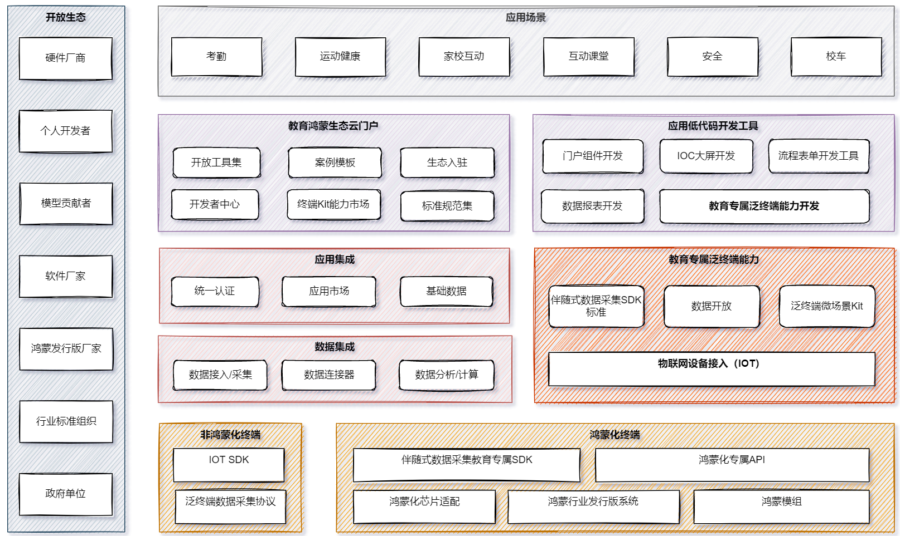

# 1. 教育鸿蒙产品整体规划

## 1.1. 架构愿景

- 技术架构要能够支撑未来5年的发展

- 要基于鸿蒙教育项目，要升级我们的架构能力

- 响应公司鸿蒙战略

## 1.2. 行业发展趋势与市场形式

产业趋势是不可阻挡

宏观是我们不可控的，微观才是我们有所作为的

- 硬软件一体化（万物互联）
  
- 数字化转型（数据互联互通）
  
- 国产化可控（鸿蒙系统）
  
- 客户预算与公司利润

## 1.3. 技术发展趋势

- 降本增效，通用的能力平台，辅助开发的低代码平台（钉钉宜搭）；
  
- 底层能力越强，通用能力越强，工具级产品越强，市场反应越迅速，市场辐射范围越大，交付成本越低；

## 1.4. 团队组织模式趋势

## 1.5. 我们团队的优势与劣势

### 1.5.1. 优势

- 已沉底多个业务产品（基础平台、大数据工具、智慧校园、学习中心、三个课堂、教研、教学督导、教师发展与评价等）
  
- 产品、技术团队有有多年的行业沉底与技术基础；

### 1.5.2. 劣势

- 缺乏硬核产品沉淀与技术实力（AI、通用平台）
  
## 1.6. 竞争对手优势与劣势

## 1.7. 630版本架构

### 1.7.1. 广东5G鸿蒙化项目

没有找到很好的切入场景，也没有找到一个合作硬件厂家,实际的交付中与鸿蒙技术交付不多，主要是搭鸿蒙概念的便车；

**原因：** 整个市场对鸿蒙的认知有限，鸿蒙化的实际研发能力也有限；

技术架构如下：

> 广东5G规划架构

  

> 广东5G实际架构

  

### 1.7.2. 鸿蒙发行版630项目

找到了切入场景，也找到了合作厂家，也开发出了部分原型，但是产品闭环没有走通，硬软件产品体验不佳，难以商业落地；

**原因：** 鸿蒙化改造能力有限，硬件厂家产品能力有限，产品规划着重演示，而忽视了

  

  

  

## 1.8. 新的整体架构

前两次其实在最早的规划中，教育团队并没有直接参与，跟多是被动接受，然后在实际的过程中进行了调整；

  

**伴随式数据采集SDK标准：**

将底层硬件需要采集的数据，定义为行业标准，鸿蒙行业发行版厂家（开鸿智谷，深开鸿）等，可以基于这些标准，在行业操作系统层面

## 1.9. 架构商业变现模式

- 独立项目模式
  
- 标准化产品模式
  
- 标准化工具模式
  
  公司内部、公司外部

- 平台+生态模式
  
  构建品牌与用户认知，拉拢硬件厂商，
  
## 1.10. 进度规划

## 1.11. 总结

- 能不能实现是一回事,先要把故事讲好；

- 力出一孔，在整体规划下，有组织的分工合作；
  
- 架构上的长远规划，与短期的产品交付要好权衡；
  
- 既不能脱离鸿蒙，也不能被鸿蒙绑死；
