<!-- # 1. 教育鸿蒙产品整体规划 -->

## 1. 背景介绍

### 1.1. 行业发展趋势与市场形式

产业趋势是不可阻挡，宏观是我们不可控的，微观才是我们有所作为的；

- 硬软件一体化（万物互联）
- 数字化转型（数据互联互通）
- 国产化可控（鸿蒙系统）
- 客户预算与公司利润

### 1.2. 技术发展趋势

- 降本增效，通用的能力平台，辅助开发的低代码平台（钉钉宜搭）；
- 底层能力越强，通用能力越强，工具级产品越强，市场反应越迅速，市场辐射范围越大，交付成本越低；

### 1.3. 团队的优势与劣势

**优势：**

- 已沉底多个业务产品（基础平台、大数据工具、智慧校园、学习中心、三个课堂、教研、教学督导、教师发展与评价等）
  
- 产品、技术团队有有多年的行业沉底与技术基础；

**劣势：**

- 缺乏硬核产品沉淀与技术实力（AI、通用平台）
  
### 1.4. 竞争对手优势与劣势

## 2. 架构愿景

### 2.1. 教育事业部战略规划

  

### 2.2. 广东省十四五规划

  

### 架构目标愿景

- 支持轻量化部署，最小化硬件资源（单校1-2台服务器，30-40万成本）；
- 支持可插拔的应用组合运行模式，通过前后端服务一起构建真正的微应用；
- 支持全代码开发、低代码开发、零代码开发所构建的混合应用运行模式；
- 支持工具集产品的独立开发、独立运行、支撑公司其他业务线项目；
- 支持云端开发、本地部署、本地运行的模式（类似罗马平台开发可以在云端SAAS平台完成，但是运行在本地);
- 复用公司已有的、开源的产品与功能，以整合为主，避免重复造轮子；

## 3. 商业模式

### 3.1. 独立项目模式

### 3.2. 标准化产品模式

### 3.3. 标准化工具模式

以标准化的工具产品作为

### 3.4. 平台+生态模式

构建品牌与用户认知，拉拢硬件厂商，

## 4. 老版本架构

### 4.1. 广东5G鸿蒙化项目

没有找到很好的切入场景，也没有找到一个合作硬件厂家,实际的交付中与鸿蒙技术交付不多，主要是搭鸿蒙概念的便车；

**原因：** 整个市场对鸿蒙的认知有限，鸿蒙化的实际研发能力也有限；

技术架构如下：

> 广东5G规划架构

  

> 广东5G实际架构

  

### 4.2. 鸿蒙发行版630项目

找到了切入场景，也找到了合作厂家，也开发出了部分原型，但是产品闭环没有走通，硬软件产品体验不佳，难以商业落地；

**原因：** 鸿蒙化改造能力有限，硬件厂家产品能力有限，产品规划着重演示，而忽视了

  

  

  
​                                                                                                   **630整体鸿蒙整体架构**

**学生证需求定位问题？**

1. 打造为全国统一的学生通用鉴权平台（类似为身份证），使用学生证与全国、不同的硬件设备 **“碰一碰”，**，实现与各种系统认证；

2. 单个项目与平台如何融合？如何实现对接？

## 5. 新版本架构

### 5.1. 现状与问题

- **业务上来说**
  - 基本都是基于基线产品做交付，离基线产品相差很有远的就是找生态厂家

- **技术上来说**
  - 除了大数据特有的一些产品，其他产品技术架构基本统一；
  - 人员、组织机构等通用功能，在产品层面进行复用；
  - 有一些能力组件与低代码工具；

- **存在问题**
  - 各个功能与能力不聚焦;
  - 工具产品与业务产品高度耦合;  
  - 目前的架构不支持**平台+生态的长远规划**；
  - 代码质量没做任何控制；
  - 项目成本的压缩，与人员的压缩，导致业务范围无法拓展；

### 5.2. 技术架构整体规划

前两次其实在最早的规划中，教育团队并没有直接参与，跟多是被动接受，然后在实际的过程中进行了调整；

**伴随式数据采集SDK标准：**

将底层硬件需要采集的数据，定义为行业标准，鸿蒙行业发行版厂家（开鸿智谷，深开鸿）等，可以基于这些标准，在行业操作系统层面

### 5.3. 学生证鉴权逻辑

> **学生证碰一碰手机场景逻辑**

> **IOT学生证鉴权逻辑**

  

> **鸿蒙电子身份证--运行逻辑**

### 5.4. 人人通集成

​

**备注：**

- user auth ID 为基础平台为用户生成的全局唯一ID;

## 6. 研发规划

### 6.1. 项目推进关键实现

1. 梳理并整理现有通用功能框架(IOC大屏、报表工具、表单填报工具、门户卡片工具)
2. 设计工具集整体平台框架（数据集成、）

### 6.2. 研发管理流程

## 7. 总结

- 能不能实现是一回事,先要把故事讲好；
- 力出一孔，在整体规划下，有组织的分工合作；
- 架构上的长远规划，与短期的产品交付要好权衡；
- 既不能脱离鸿蒙，也不能被鸿蒙绑死；

## 8. 参考资料

[教育云平台认证中心逻辑架构](https://kdocs.cn/l/ctCLIuIRlABz)
[教育行业平台架构方案](https://kdocs.cn/l/cvoyaoViLw9q)

## 9. 广东研讨会筹备

### 9.1. 系统准备

- 将配置信息给许教授沟通--周果

  - 已经分配了5台8核16G的服务器资源；
  - 一共9台（8C 32G）
  
2）部署架构设计与部署方案设计（在粤教云容器平台上部署）--张可
3）根据目前教授给的资源，进行部署预研--张可
4）演示环境的演示脚本准备--罗雯

- 教研院的8楼有个样板间（北师智慧的智慧课堂，需要替换为罗博的智慧场景）
- 需要协调罗博手写板硬件设备与软件部署；

5）机顶盒互动的场景演示 --胡侃
6）智慧作业笔盒场景演示 --马世军
7）确定最终的研讨会议的时间 --王总
8）人人通对接方案设计（南方未名）--周果

- 认证是自己建设还是统计接入了粤教云？
- 基础数据是否与学籍系统打通？
- 业务上有哪些角色空间？
- 是否有PC端，移动端？

### 粤教翔云交流

**问题：**

- 粤教翔云的登录入口在哪里？用户数据从哪里来？谁来维护？目前整个平台的用户量大概是多少？
   1. 省教育厅提供基础的用户数据，但是数据的维护还是在粤教翔中维护，省厅的数据及时性与完整性不全（制度原因）

- 第三方的应用是如何与粤教翔云进行对接的？第三方系统的用户体系与粤教翔云的账号是什么关系？
- 开放平台具体有哪些功能？能不能简单介绍一下？
- 广东省公共服务平台、粤教翔云平台、网络空间平台
  
**思路：**

- 拓维作为终端应用厂家，接入到粤教云平台，为用户提供创新场景;
- 粤教云的后面的盈利模式：通过占位平台发展C端客户，通过C端付费用户盈利；
  
- 省教育厅提供基础的用户数据，但是数据的维护还是在粤教翔中维护，省厅的数据及时性与完整性不全（制度原因）
- 粤教翔云其实就是天喻的云平台的概念，为全省提供一个统一大平台
- 目前只是在德庆做试点，但是全省的基础数据已经从全国学籍系统获取
- 三种运行模式，统一使用省平台的、区域自己建设区域平台、使用之前的平台只是数据上与省平台互通；
  

[广东省教育资源公共服务平(gdedu.gov.cn)](http://zy.gdedu.gov.cn/)

### 身份可信认证中心（全国学籍系统）交流

**- 问题**

1. 目前全省的教育用户信息，是不是都是通过咱们这边进行管理的？（广东省考试院、东莞市、白云区（培英中心需要与可性对接）、进行了试点）

2. 如果我们系统要对接咱们的系统(比如我们的培英中学要接入),大概是一个什么样的框架与流程(PC端接入、APP端接入、用户登录页面是谁做)？

3. 学生的真实信息到底是从哪里维护？（学校维护、教育局统一维护？）
   - 全国通过一个平台由下面的学校进行学生的维护;

4. 用户是如何感知，身份可以通过不同的载体进行，硬件卡（手环、电子学生证），软件账户，人脸，二维码，移动客户端；

   全国中小学管理服务平台(学有优教)
   [App Store 上的“学有优教?](https://apps.apple.com/cn/app/%E5%AD%A6%E6%9C%89%E4%BC%98%E6%95%99/id1629290088)

   类似与全国资源服务平台
  

高中以上的学生
  

需要由学校发起激活码
  

  

  

**- 思考**

1. 教育可信数字身份，解决不合规的问题（使用技术手段）
   国产加密体系
   数字签名与证书
   数据加密与共享
   身份识别与鉴权
     

学有优教作为统一的入口，第三方应用入住到学有优教系统里面；
应用产生的数据，可以一级级的进行上报共享；
硬件中的唯一IMIE号不一定

  

   5个省份为试点（广东、广西、新疆、河南、安徽）

1. 数据发行的机构是教育部、技术服务支持为技术中心;
