<!-- # 低代码架构解析 -->

## 1. 基本概况

### 1.1. 为什么要讲低代码？

* 1、低代码的热度情况；

* 2、在其他项目上尝试过低代码，但是都不怎么成功，对于我自己来说，也是需要复盘总结反思的。
  > 从技术架构上来说，还存在很多技术债，从产品上来说它都没有走出去，从商业价值也并没有非常高的投入产出比。
  
教育侧宁夏项目第三方组件开发（代码版本，可视化操作版本）；

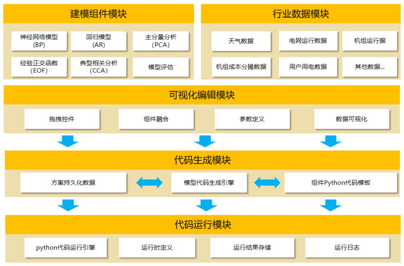  

电力行业机器学习平台

* 3、目前项目交付部，对交付人员成本、交付周期都提出了更高的要求，那么低代码会不会适合我们公司？投入产出比会怎么样，我们有没有可能投入到低代码？这些问题都需要深入的思考与辩证才能有答案；

### 1.2. 讲哪些内容？

#### 1.2.1. 现状与发展趋势

#### 1.2.2. 个人的判断与理解

**结论1：**
> 低代码本身是一个非常宽泛的概念，各家的产品形态，解决的业务场景也都不一样，

**结论2：**
> 低代码开发在一定程度上，一定是未来的趋势

**结论3：**
> 可视化不是低代码的目的，高效率才是；

**结论4：**
> 从使用场景上来说，我们可以理解为低代码是更高级别的配置；

**结论5：**

> 通过模板生成代码的工具，严格意义来说并不是低代码，

#### 1.2.3. 整体运行逻辑

#### 1.2.4. 关键技术路径

#### 1.2.5. 普及与推广问题

## 2. 现状与发展趋势

**理由1：**

* 引用目前权威机构发布的市场报告（资料来源极客时间专栏）

* 根据个人的理解与判断得出的几点结论；

**理由2：**

* 宁夏项目钉钉的易搭平台，只使用了一个实施人员就完成了开发的交付；

**理由3：**

* 研发成本

* 交付周期

### 2.1. 低代码的业务场景需求

已数据为中心的应用（表单、报表类）

已流程为中心的应用（工作流类）

已计算为中心的应用（大数据、机器学习）

从难易程度上来看可分为：简单、复杂

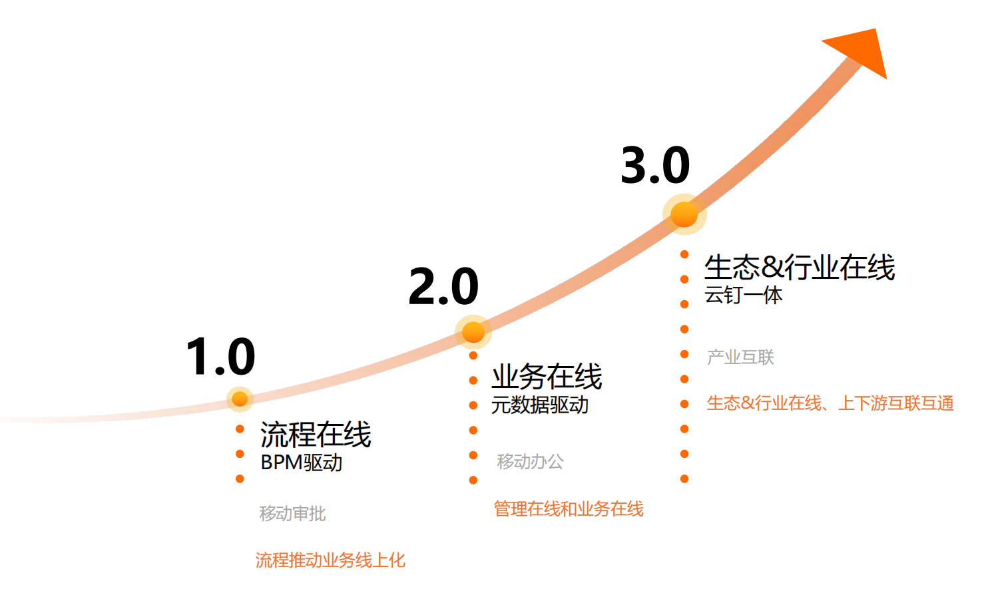  

 **低代码是一个研发范式的转变**，这句话听上去很振奋人心

### 2.2. 低代码平台发展路径

MVP期、成熟期、超越期，这三个时期的划分，

从工作流引擎到轻应用低代码平台

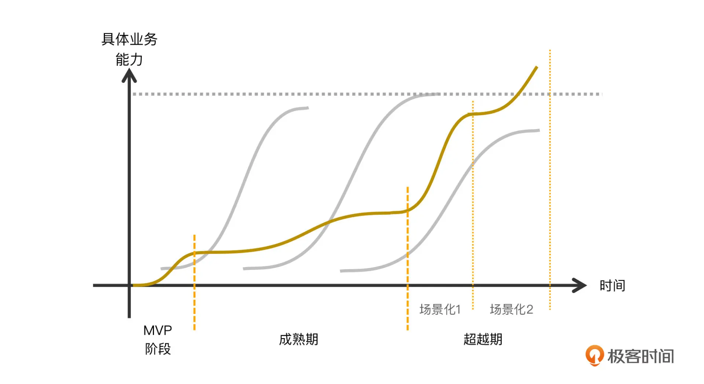  

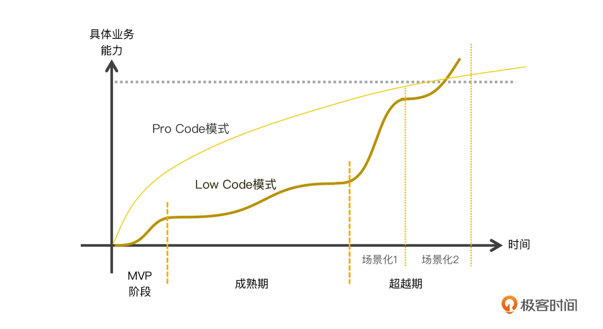  

## 3. 整体架构

### 3.1. 运行流程图

* 从运行逻辑的角度讲解低代码平台
  
* 从分成框架的角度理解低代码平台

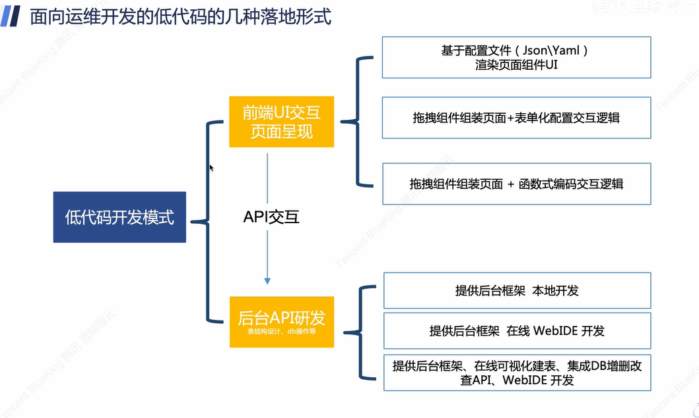  

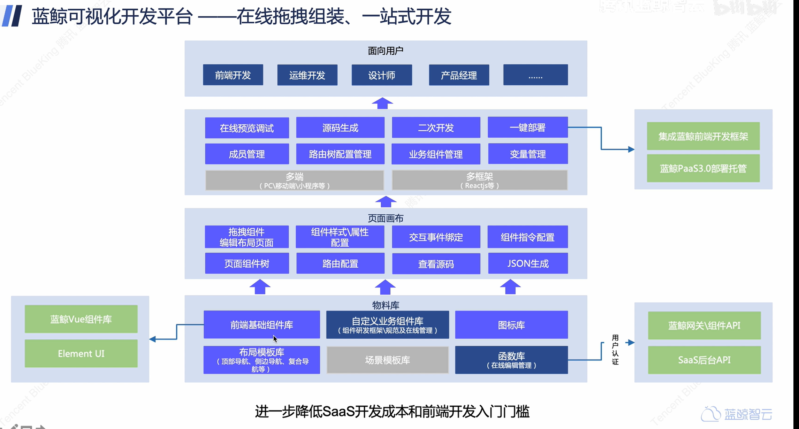  

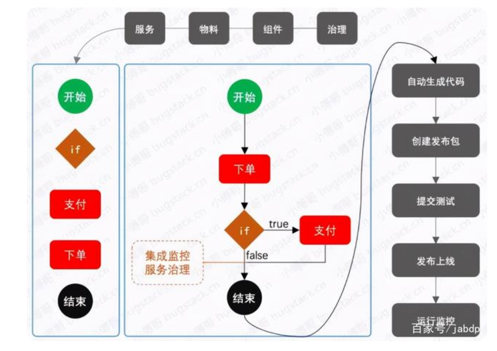  

### 3.2. 功能架构视图

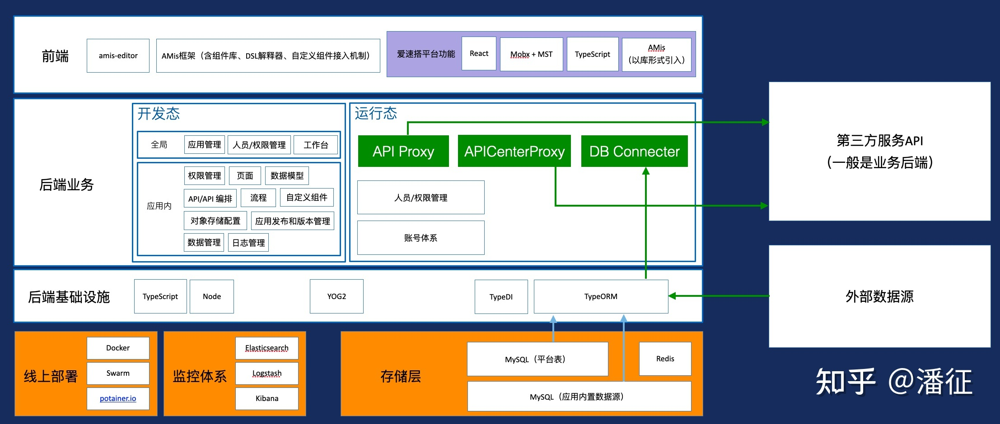  

## 4. 前端关键技术问题

App开发的三要素：布局、交互、-数据

apaas平台与低代码的关系；

### 4.1. 编辑器  

编辑器一个最基本的要求就是、所见即所得，创建应用的过程就是生成并运行应用代码的过程，编辑器在收集到开发人员的操作后，应该立即生成应用的代码。

编辑器的核心目标：将模型配置（json）配置转换成对应的 React 组件并在页面上渲染出来；

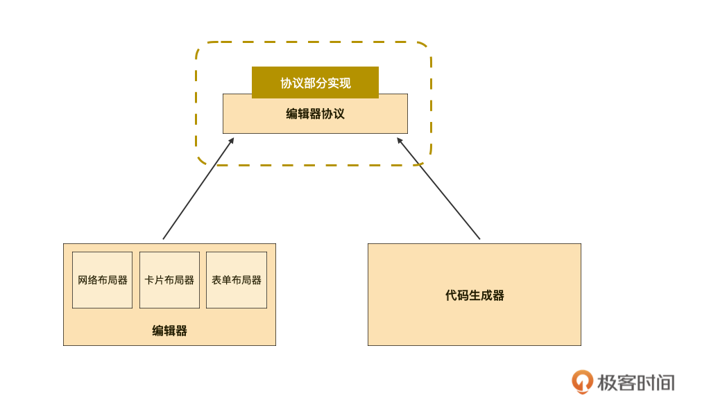  

### 4.2. 代码生成器

其实界面拖拖拽拽生成特定功能的门槛并不高，但是要承载厚重的低代码战车，则需要有很深远的设计和思考，其中最重要的一环是如何生成应用的代码？

> 代码生成器是如何实现的？

### 4.3. 运行态

关于代码的可维护性，我常常说的一句话是：一个if一个坑

### 4.4. 连接器

连接器功能，以解决企业数据跨应用流通的难题

### 4.5. 可视化逻辑编排

BPM

FBP

通过图形化可视化界⾯，将逻辑代码表达为逻，辑节点与线条，对代码逻辑、业务流程和数据处理逻辑等进⾏编排

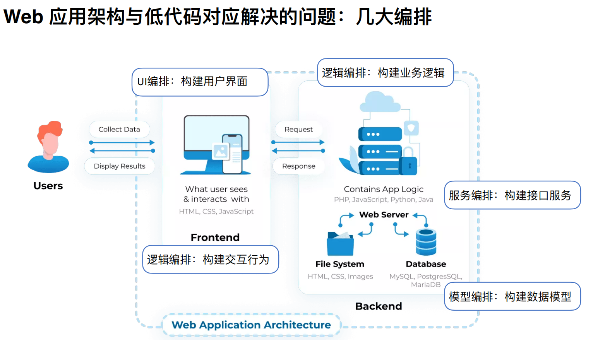  

### 4.6. UI可视化

### 4.7. 元数据模型

**核心：** 将代码抽象为数据模型，再通过数据模型还原代码，数据模型就是代码编辑器与代码生成器之间的协议规范；

将json配置转换成对应的React组件并在页面上渲染出来

简单来说就是先通过 json 的 type 找到对应的 Component，然后把其他属性作为 props 传递过去完成渲染。

代码：

``` javascript
 <button id="btn_001" onclick="changText_001()">hello</button>
    <script>
        function changText_001() {
            btn.innerText = "world"
        }
    </script>
```

数据模型：

``` json
{
   id:"btn_001",
   type: "button",
   actionList: [
    {
      eventType:"click",
      actionList: {
        actionId: "changText_001",
        actionType: "changText"
        params: "world"
     }
    } 
   ],
   value:"hello"
 }
```

``` json
{
  "type": "page",
  "body": {
    "title": "",
    "type": "form",
    "mode": "horizontal",
    "body": [
      {
        "label": "选项1",
        "type": "radios",
        "name": "a",
        "inline": true,
        "options": [
          {
            "label": "选项A",
            "value": 1
          },
          {
            "label": "选项B",
            "value": 2
          },
          {
            "label": "选项C",
            "value": 3
          }
        ]
      },
      {
        "label": "选项2",
        "type": "select",
        "size": "sm",
        "name": "b",
        "source": "/amis/api/mock2/options/level2?a=${a}",
        "description": "切换<code>选项1</code>的值，会触发<code>选项2</code>的<code>source</code> 接口重新拉取"
      }
    ],
    "actions": []
  }
}
```

### 4.8. API 通信数据连接

## 5. 后端关键技术问题

### 5.1. 数据如何存储？

### 5.2. 后端业务逻辑如何实现？

### 5.3. 业务流程如何实现？

## 6. 普及与推广问题

### 6.1. 推广中存在的问题？

我们的⽤户是谁？（前端团队是我们的⽤户吗）

业务侧学习成本问题（⽆代码要做到什么程度）

合作伙伴配合度问题（利益如何分配）

是Follow还是改变的问题（存量场景怎么办）

如何度量的问题（如何⽤指标体现低代码的价值）

只能搭建活动⻚和中后台⻚⾯吗？（如何探索更多场景）

### 6.2. 如何衡量商业变现？

场景覆盖率，业务覆盖率，ROI，融合度，被集成，可扩展性，稳定性；

度量指标：

## 7. 参考资料

[快手开源低代码平台](https://mybricks.world)

DooringX

* 腾讯oteam
RPA

* 中信
Awade

* 微软
Power Platform

* Jeecg
[JEECG官方网站 - 基于BPM的低代码开发平](http://www.jeecg.com/)

* 若依
  [RuoYi 若依官方网站](http://www.ruoyi.vip/)
  
* 微软 PowerApps
[微软 PowerApps](https://www.bilibili.com/video/BV1KQ4y1N7ef?spm_id_from=333.337.search-card.all.click&vd_source=72c007389b5d6fad1158a9dee89efe97)

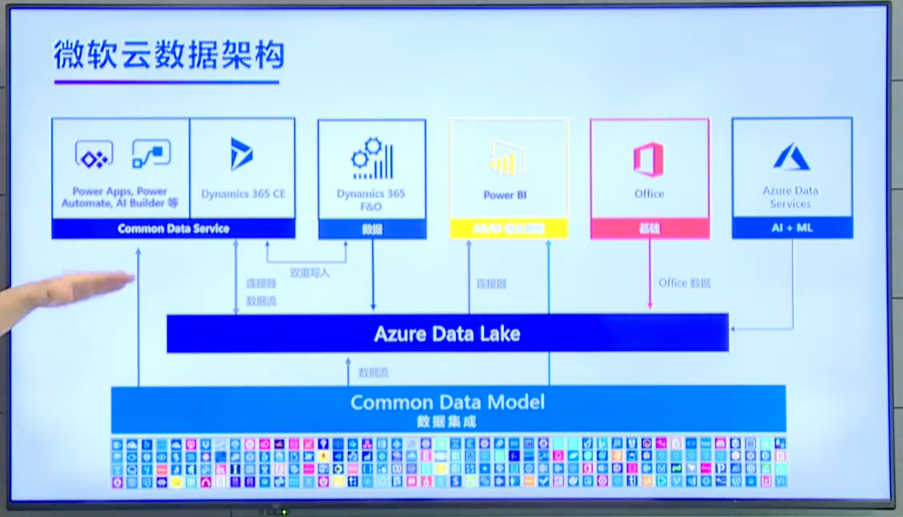  

[百度 爱速搭整体架构](https://zhuanlan.zhihu.com/p/522822327)
[低代码平台架构深度剖](https://static001.geekbang.org/con/94/pdf/2570895022/file/%E4%BD%8E%E4%BB%A3%E7%A0%81%E5%B9%B3%E5%8F%B0%E6%9E%B6%E6%9E%84%E6%B7%B1%E5%BA%A6%E5%89%96%E6%9E%90%20-%20%E6%BD%98%E5%BE%81.pdf)

* 需重点阅读文章，文章以爱速搭为为例，介绍了低代码平台基本的运行逻辑；
  
[从实现原理谈谈低代码 (qq.com)](https://mp.weixin.qq.com/s?__biz=MzIwMzY1OTU1NQ==&mid=2247514756&idx=1&sn=e1365ed80281443b3680640abe4d7a1e&chksm=96cefac8a1b973de46783702ade4325b72d245b8c8d20fef01427392831f6ed7744b57241937&scene=27#wechat_redirect)
