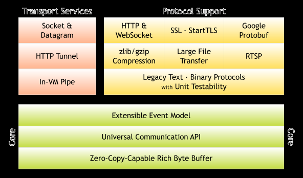

Netty网络编程

# netty核心设计要点

## 事件轮询器

EventLoop

## Reactor线程模型

   保证netty的高性能

## 责任链处理模式

## 零拷贝机制

   应用层的实现，而非JDK底层的实现从逻辑上对数据进行操作,而不对实际数据进行移动,减少了大量的数据复制，提升性能

## ByteBuf

（ByteBuf：通过一个读索引与写索引俩个索引共同来操作内存区域）比NIO的API更丰富，并且能自动扩容

+ 入站：由socket发出来的事件
+ 出站：由程序向socket发送事件
+ 使用长连接（不关闭socket的close方法）

# Netty架构

  

# 自己实现一个推送系统

1——推送服务（pull service 主要负责消息的分发,不包含业务逻辑）
2--推送平台API（rpc，http）
3--推送消息

## 问题

    + 1）推送服务集群部署，客户端选择哪个推送服务呢？可通过一个注册中心来实现，由客户端来获取选择哪个服务器。
    + 2）粘包，拆包的问题

## 实现

    1、先确定协议
      1）目标用户的ID
      2）消息内容字符串最多70个字节，
    2、确定底层通信

# 单机支持10万并发优化步骤

+ 1、把进程的最大文件打开数量调整为100万（默认1024）
+ 2、调整默认本地端口的区间端，满足跟多的端口
+ 3、Handler的复用，不用每次都创建新对象（但是要主要是否有资源共享的问题）
+ 4、调整字节缓存区的大小
+ 5、使用多线程运行业务代码（制定线程名称），要看任务是什么类型，CPU密集型、IO密集型
+ 6、复用Bytebuf对象（visualvm监控工具）
+ 7、可使用fork join技术将任务进行拆分，防止大任务占用过多的资源，导致
+ 8、单台QPS能支持3000（redis单机可以处理10万）
+ 9、使用netty的自带内存监控功能（）
+ 10、性能压测要尽可能要接近真实的环境，如压测时间，

# 实战经验

+ 连接与QPS的区别，1G内存大概能支持10万的连接

+ 内存过得被操作系统kill，
+ 全链路压测

# netty在开源项目中的应用

+ 美团的实时监控平台CAT使用Netty完成底层通信
+ 阿里的dubbo使用CAT作为底层通信

## 参考文档

[Netty高并发处理架构设计介绍](https://xie.infoq.cn/article/228fa0b6cca05acf4f18f5a1a)
[网易netty开发](https://www.bilibili.com/video/BV1UC4y1H7YY?p=20)
[netty官网](https://netty.io/)
