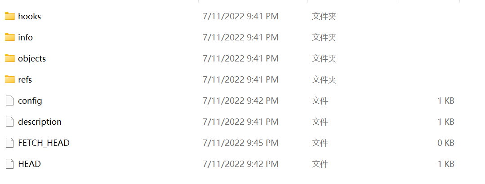

**目录结构**
[[toc]]

# Git原理与实践

## 1. 概述

Git作为一个版本管理工具，我们只要听到它是由Linus Torvalds(Linux内核的最早作者)开发设计的，就对它肃然起敬了，在同类工具中算是一骑绝尘，Git凭借着优雅的设计、丰富的功能、简单的操作，极高的性能，力压其他工具成为市场占有率最高的工具，也是程序员群体必备的、使用最频繁的工具；

但是，对于大部分程序员，平时的使用场景可能都只是在各个插件之上，进行简单的提交，合并等操作。而对于初学着会对git的命令感到困惑，一般使用死记硬背的方式去学习，这样导致一旦长时间不用就会忘记，或者出现一些异常情况就不知道如何处理。
究其原因，主要是因为对Git的底层原理与设计不了解，这好比：不了JVM的原理进行虚拟机调优，不了解myslq索引的原理进行索引优化一样；

因此，这篇文章我们从Git的一些核心概念与底层原理发出，带领大家对Git有一个深入的、全面的了解，然后再针对实际开发过程中使用最频繁的操作做一些总结，最后我们会针对Git的一些高级、同时对效率有极大提升的功能进行说明，希望通过这篇文章让大家对Git从里到外、从原理到实践有一个全面的认识，最终是提高我们的研发效能；

## 2. 核心概念

- Git在本机的文件系统之上构建一个小的文件系统。这个小型的文件系统就是 **.git/objects**目录；

- Git中的所有操作，都是通过内部定义的4种类型的对象来实现（" **blob**"、" **tree**"、 " **commit**" 和" **tag**"）
- Git记录了每次提交，每个文件的全部内容（snapshot快照）；

## 3. 底层原理

### 3.1. 目录结构

一个被git管理的项目，在本地的文件夹目录下，会有一个固定的目录格式，我们先从这个目录结构说起，整个文件夹为***工作目录***，.git文件夹为**Git目录**，Git文件之外的**工作目录**；如下图所示；

<!--    -->

- **Git目录**

Git目录是项目存储所有历史和元信息的目录 - 包括所有的对象(***commits,trees,blobs,tags***)，每一个项目只能有一个'Git目录，下面我们来具体看看Git目录中有哪些信息；

<!--  -->

> Git目录中有5个核心文件既文件夹，config，objects，HEAD，index，refs ；

- **config**：

  存储项目配置信息，比如是否以 bare 方式初始化，remote 信息，git remote add 添加的远程分支信息等等；

- **objects**：

> 保存git对象，git中的操作以及文件都会以 git 对象形式保存至此，git 对象分为 **blobs，tree，commit** 三种类型，比如 git commit 就是 commit 类型变量，各个版本之间通过版本树进行组织，比如 HEAD 指向某个 commit 对象，而 commit 对象又会指向几个 BLOB 对象或者 tree 对象。objects 文件夹中有很多子文件夹，其中 git 对象保存在以其 sha-1 值的前两位为子文件夹后 38 位为文件名的文件中，此外 git 为了节省存储对象所占用的磁盘空间，会定期对 git 对象进行压缩和打包，其中 pack 文件夹用于存放打包压缩的对象，info 文件夹用于从打包的文件中查找 git 对象；

- **HEAD**：
该文件指明了本地的分支结果，如本地分支是 master，那么 HEAD 就指向 master，分支在 refs 中就会表示成`refs:refs/heads/master`

- **index**：
该文件 stage 暂存区信息，也就是 add 之后保存到的区域，内容包括它指向的文件的时间戳;

- **refs**：
refs目录下面是一些纯文本文件，分别记录着本地分支和远程分支的***SHA***哈希值。文件的数量取决于分支的数量

- **hooks**：
这里主要定义了客户端或服务端的 hook 脚本，这些脚本用于在特定命令和操作之前、之后进行特殊处理

- **description**
：仅供 GitWeb 程序使用

- **logs**：
记录了本地仓库和远程仓库的每一个分支的提交信息，即所有 commit 对象都会被记录在此，这个文件夹内容应该是我们查看最频繁的，如 git log

- **info**：
其中保存了一份不希望在 .gitignore 文件中管理的忽略的全局可执行文件

- **COMMIT_EDITMSG**：
记录了最后一次提交时的注释信息

### 3.2. 状态模型

下图描述了 git 对象的在不同的生命周期中不同的存储位置，通过不同的 git 命令改变 git 对象的存储生命周期

<!--  -->

**工作区 (workspace)**
就是我们当前工作空间，也就是我们当前能在本地文件夹下面看到的文件结构。初始化工作空间或者工作空间 clean 的时候，文件内容和 index 暂存区是一致的，随着修改，工作区文件在没有 add 到暂存区时候，工作区将和暂存区是不一致的；

**暂存区 (index)**
老版本概念也叫 Cache 区，就是文件暂时存放的地方，所有暂时存放在暂存区中的文件将随着一个 commit 一起提交到 local repository 此时 local repository 里面文件将完全被暂存区所取代。暂存区是 git 架构设计中非常重要和难理解的一部分；

**本地仓库 (local repository)**
git 是分布式版本控制系统，和其他版本控制系统不同的是他可以完全去中心化工作，可以不用和中央服务器 (remote server) 进行通信，在本地即可进行全部离线操作，包括 log，history，commit，diff 等等。完成离线操作最核心是因为 git 有一个几乎和远程一样的本地仓库，所有本地离线操作都可以在本地完成，等需要的时候再可以与远程进行同步，本地仓库都存储在**git下面的object文件**夹下。

**远程仓库 (remote repository)**
中心化仓库，所有人共享，本地仓库会需要和远程仓库进行交互，也就能将其他所有人内容更新到本地仓库把自己内容上传分享给其他人。结构大体和本地仓库一样。

### 3.3. 存储模型

> **文件内容到SHA的映射**, Git中的一个关键核心就是**哈希算法**，Git通过将实际的文件内容进行哈希计算，因为哈希的特点，相同的内容会计算出相同的哈希值，不同的内容计算出不同的哈希值，Git通过比较与管理文件的哈希值，来实现高效、与低冗余；

**Git中的所有的存储包括4种类型的对象（object），blob ，tree，commit，tag**，这几种对象的逻辑关系如下图所示：

<!--  -->

**blob：**存储文件数据，就是一个文件；

- 一个"blob对象"就是一块二进制数据，它没有指向任何东西或有任何其它属性；

- 被Git管理的所有文件，都会生成一个blob文件；

- 相同的文件内容，只会存储一个blob对象（SHA值相同）；

**tree：**可以理解为目录或者集合，用来管理tree或者blob；

- 一个tree对象关联者一串(bunch)blob对象或是其它tree对象的指针;
- tree对象存储的是指针（tree和blob的SHA哈希值）并不存储真正的对象数据；

<!--  -->

<!--  -->

**commit：** 标识某个时间点的状态，内容包括：时间点元数据，提交作者等，一个commit指向一个tree；

> commint对象是我们接触得最频繁的对象，我们一般使用的commit命令（merge，pull、push等等）都直接与commit对象打交道；

<!-- 

 -->

- tree对象： 标识者commit对象中涉及的相关tree对象（tree对象最终关联着blod对象，而blod对象由实际文件生成）；

- parent：关联的上一次提交的commit对象，commit对象最终可以定位到blod对象，通过blod的SHA1值可以确定文件是否变化；

**tag：** tag用来标记一个提交（commit）的方法；、

### 3.4. 分支管理

## 4. 使用实践

### 4.1. git安装与配置

- 配置git信息

``` shell
git config --global user.name "zhouguo"
git config --global user.email ["378046832@qq.com"](mailto:\)
```

### 4.2. SSH远程访问

相当于在某某人的github中添加远程连接权限，这里是在自己的github账号中添加自己包含本地的git信息的密钥，让本地git能远程连接到github。

**第一步：使用git bash生成秘钥**
使用 ssh-keygen -t rsa 命令生成证书文件及密钥(信息中包含你的git用户和邮箱)
<!--  -->

**第二步：将密钥加到[github](https://so.csdn.net/so/search?q=github&spm=1001.2101.3001.7020)的setting中SSH Keys中**

### 4.3. 远程仓库clone到本地

- 先在本地新建一个文件夹demo，作为本地代码仓库；

- 进入demo文件夹下，单击鼠标右键，选择git bash here，打开git bash终端；

- 在git bash终端输入git init命令，初始化本地仓库；

  ```shell
  git init 
  ```

- 利用git clone url命令，将需要的项目从github上clone下来；
  
  ```shell
  git clone  --url为github中的git地址
  ```

### 4.4. 本地仓库提交到GitHub

初始化本地仓库，把代码的文件夹变成一个仓库，使用`git init`命令，在本地文件夹下，右键打开git bash终端，初始化完成之后，本地文件夹下会生成.git文件；

注意：提交到远程仓库之前，要确保工作区中的代码提交到了本地

  ```shell
  git init 
  ```

- 将代码添加到远程仓库，需要在git上创建一个repository

  ```shell
  git remote add origin --https://github.com/mnzhouguo/zgdoc-technology.git
  ```

- 创建main分支

  ```shell
  git branch -M main
  ```

- 推送代码推送到远程main分支

  ```shell
  git push -u origin main
  ```

  ```shell
  # 
  git remote add origin https://github.com/mnzhouguo/zgdoc-technology.git
  git branch -M main
  git push -u origin main
  
  ```

### 4.5. 常用命令

  ```shell
  # 查看修改的内容
  git status

  # 添加文件
  git add

  git commit -a -m 

  git restore 
  # (use "git add/rm ..." to update what will be committed)
  # (use "git restore ..." to discard changes in working directory)

  ```

### 4.6. 获取远程更新

``` shell
# 查看当前远程分⽀
$ git remote -v
# 直接拉取远程分支最新代码并合并最新代码到本地当前分支
$ git pull origin master    `**⽰例：拉取远端origin/master分⽀合并到本地当前分⽀**`
```

### 4.7. 基于master创建新分支

在已经克隆下来的本地项目的文件夹目录中，空白处，点击鼠标右键，选择Git Bash Here，打开git命令窗口。

``` shell
# 1. 首先，进入master分支：
git checkout master

# 2. 拉取master最新项目到本地master分支：
git pull

# 3. 创建新分支dev，并把当前master分支内容复制一份到新分支dev中：
git checkout -b dev

# 4. 把新建分支dev推送到远端：
git push origin dev

# 5. 将远端的dev分支和本地的dev分支关联起来：
git branch --set-upstream-to=origin/dev

# 6. 验证创建的分支是否成功：
git pull
```

当出现Already up to date，代表该分支创建成功。

## 5. 常见问题

### 5.1. git Failed to connect to github.com port 443

-[2] to include in what will be committed

### 5.2. error: src refspec main does not match any

### 5.3. error: failed to push some refs to

**产生原因：**

When multiple developers work on the same branch, it can cause a sequencing issue in Git. A commit gets rejected and causes a failed to push some refs to error because the remote branch contains code that you do not have locally. What this means is that your local git repository is not compatible with the remote origin.

 [解决办法](https://komodor.com/learn/how-to-fix-failed-to-push-some-refs-to-git-errors/#:~:text=failed%20to%20push%20some%20refs%20to%20errors%20are%20often%20caused,sync%20with%20the%20Git%20repository)

### 5.4. OpenSSL SSL_read: Connection was reset, errno 10054

**产生原因：**

一般是这是因为服务器的SSL证书没有经过第三方机构的签署

**解决办法：**

``` shell
# 解除ssl验证
git config --global http.sslVerify "false"
```

### 5.5. fatal: Couldn't find remote ref master

### 5.6. Another git process seems to be running in this repository

根据我们所了解到的，windows对于进程的同步互斥管理，是有资源上锁机制的。猜测这里肯定是有进程对某资源进行了加锁，但是由于进程突然崩溃，未来得及解锁，导致其他进程访问不了。

根据提示，打开文件夹选项，打开显示隐藏文件，进入工作区目录下的隐藏文件.git，其中的index.lock文件删除掉;

## 6. 参考文档

[Git连接GitHub](https://blog.csdn.net/qq_37808895/article/details/90733824)
[Git对象(git-scm.com)](https://git-scm.com/book/zh/v2/Git-内部原理-Git-对象)
