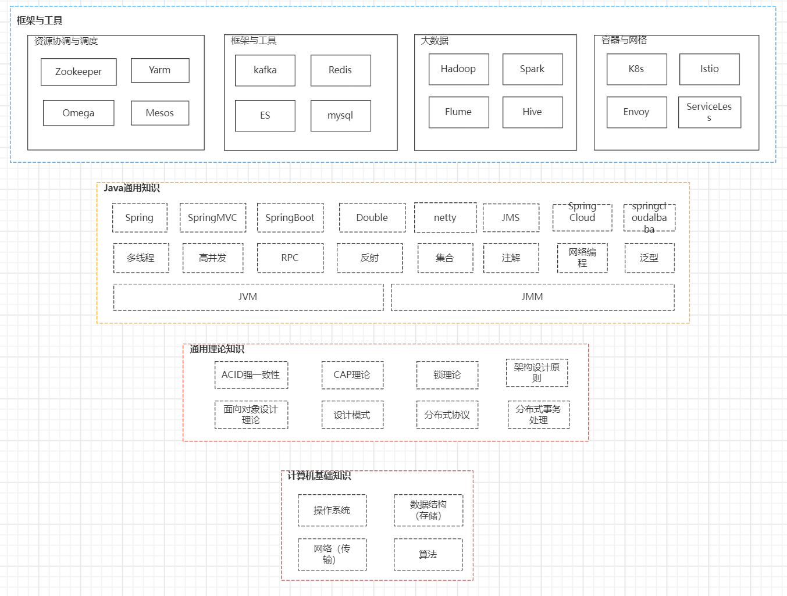

## 为什么要写该文档？

我们看到市面上新技术、新概念层出不穷，每隔一段时间就会有一个新技术腾空出世替代老技术，这个是我们必须接受的可观规律，王朝更迭,江山易主,世事山河都会变迁，技术与经济、历史一样具有周期性，只是这个周期在软件行业更迭的太快，在程序员的职业生涯里面，大部分的技术可能要迭代更新很多论，**"一招鲜，吃遍天"在软件行业可能不灵验，**有追求的程序员需要时刻保持着一颗谦卑的心，不断的迎接变化、持续学习，从而让自己超越技术周期；

那有人可能会说，这样会很累，对于这个问题我要看**怎么定义这个累**,每个人的追求与活法都不一样，累与不累，哪些事情你觉得累，哪些事情你觉得开心、快乐，都是我们自己内心的选择。所以，我们觉得累也是非常正常的，如果觉得学习很累，那我们可以选择在生活上累一点，如果我们觉得学习、生活上我都不想那么累，并且我都可以做到不累，那，我真的要恭喜你，那你真的是**跳出三界外不在五行中**,你可以洒脱、不受世俗干扰、大彻大悟了；

如果我们下定决心要学习，那具体应该如何学呢？一个最有效的方法就是：**构建自己的技术知识体系**，有一个概念叫**知识负荷**,大体意思是：当我们学习一个新知识时，需要花费的精力或时间，当我们有大量知识存量时，再去学与之相关联的知识，所花费的成本（精力、时间）就会低很多。因此，只要我们构建了自己的知识体系，各个知识都能融合贯通、能够进行知识迁移，再去学一些新技术就会轻松许多；

下面是一张知识体系的整体概貌图，我们可以看到整个知识体系可分为4层面，并且是一个倒金字塔的结构，从下往上依次是，**计算机基础知识，通用理论知识，Java通用知识，框架与工具**。我们发现越往上面越范围越宽，越往下面范围越窄，越往上面技术更新迭代越快，越往下技术越稳定，比如：TCP协议从发明到现在，基本没有什么太大变化；

  

本书的目标就是希望，将图中的每一块知识形成知识图谱与脉络，每一块知识都形成自己的理解与认知，并且通过一篇一篇的文章将其呈现出来，很显然这是一个庞大的工程，但是没有关系因为我们有的时间，**我们总是高估自己在短期内能完成的事情，却又低估自己在长期所能取得的成就**，日拱一卒，不断的积累，我相信一定会有好的结果；

[Java程序员技术体系](https://kdocs.cn/l/cvX2fmeKoIaG)

## 版权声明

## 关键字

飞轮效应、马太效应、认知负荷
